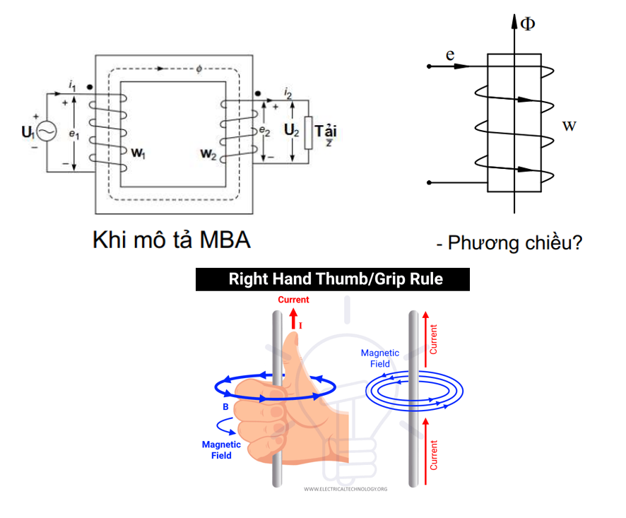

# #1 Tổng quan lý thuyết về động cơ

Table of Contents:

---

This series intends to be my notes about fundamental of knowledges for BLDC motor control as well as a chance to improve my English writing skill.

In this series, I want to go from the fundamental theory in physics to the “how do the BLDC work and how to control it?”. Let’s begin

---

## I. The needed physics theories

For the understand of how the motor work, we must have the basic of knowledge about some physics theories listed in this below section.

### 1. The law of electromagnetic induction (Faraday’s Law)

- Case 1: When the flux $\phi$  varies through the winding

When the flux $\phi$ varies through the winding, it will induce a induced electromotive force (emf) $e$ . The direction of $e$  can be determined based on the **Corkscrew rule** (Right hand rule) (Figure 1). The inducted electromagnetic force in the winding can be calculate based on Maxwell’s equation:

$$
e = -w\frac{d\phi}{dt} = -\frac{d\Psi}{dt} \tag{1} 
$$

with $w$  is the numbers of the winding, $\phi$  is the flux through a wire, $\Psi$  is the sum of the flux through the winding.

*Figure 1: The Right hand rule.* 

- Case 2: When the conductor moves in the magnetic field

When the conductor moves with the velocity $v$  in perpendicular with magnetic field lines (Figure 2), A emf appear in the conductor as: 

$$
e = Blv \tag{2} 
$$

with B is flux destiny (T), $l$ is the length of the conductor (m), $v$  is the velocity of the conductor (m/s).

Figure 2: When the conductor moves in the magnetic field.

### 2. The law of electromagnetic force

A current-carrying conductor placed perpendicular to the magnetic field lines will experience an electromagnetic force with a magnitude of:

$$
F = Bil \tag{3}
$$

with $i$  is the current flows in the conductor, $l$  is the length of the conductor.

Figure 3: The electromagnetic force can be determined based on Left hand rule.

### 3. The Law of Total Current (Ampere’s Circuital Law)

The integration of the magnetic intensity according a closed loop of the circuits equals to the sum of currents in the number of wires $w$ :

$$
\oint \mathbf{H} \cdot d\mathbf{l} = \sum i = i \cdot w = F \tag{4}
$$

with H: Flux intensity [A/m], F: magnetomotive force (mmf) [A.turns].

*Figure 4: The law of total current visualization.*

### 4. Kirchhoff’ Law

- Kirchhoff 1: The sum of currents in a node equals to zero.

$$
\sum_{node} i = 0 \tag{5}
$$

Sign rule: In = +, Out = -.

- Kirchhoff 2:  According to the closed circuit with arbitrary direction, the algebra sum of the voltage on the elements is equal to the algebra sum of the electromotive forces.

$$
\sum u = \sum e \tag{6}
$$

Sign rule: The same to conventional direction = +, in opposite is -.

## References

[1] Máy điện cơ sở  - EE3140 - Teaching slides - Phạm Minh Tú - SEEE - HUST